# Email Receipt Ingestion v1

**Status:** PLANNED · **Date:** 2026-10-03  
**Goal:** Let a user give a retailer a Deceipt email address such as `mateo@deceipt.com`, receive the retailer's normal email receipt, and have Deceipt automatically add a parsed receipt to the user's account.

## 1. Product experience

The simplest customer flow should be:

1. User signs into Deceipt and is assigned a Deceipt receipt address.
2. At checkout, a retailer that does not support Deceipt asks for an email address.
3. User provides `<handle>@deceipt.com`.
4. Retailer sends its ordinary email receipt.
5. Deceipt receives the message, identifies the owning account, parses the receipt, validates/reconciles extracted monetary facts, saves it, and queues classification.
6. The receipt appears in the user's receipt history.
7. If extraction confidence is insufficient, the receipt still appears as **Needs review** rather than disappearing.

The feature is a compatibility bridge for existing retailers. It is not a replacement for native Deceipt merchant signatures.

## 2. Address model

### v1
Each account receives one human-friendly primary address:

```text
<handle>@deceipt.com
```

The alias maps server-side to a Deceipt user/account ID. The user's real personal email address does not need to be exposed to the merchant.

### Later hardening
Support revocable aliases without changing the product model:

- `<handle>+<merchant>@deceipt.com`
- random aliases mapped to the same account
- one alias per merchant or shopping context
- alias disable/rotate controls

This gives users a way to contain spam or leaked addresses while retaining the simple primary address.

## 3. Trust semantics

Email receipts must have a distinct verification state.

Recommended initial source/trust metadata:

```text
source.kind            = "email"
source.message_id      = ...
source.received_at     = ...
verification.kind      = "external_unverified"
verification.reason    = "email_import"
```

Email authentication signals may be stored as evidence:

- SPF result
- DKIM result
- DMARC result
- envelope sender
- visible From address
- sending domain

They may improve spam handling or parser confidence, but **must not** be treated as equivalent to a Deceipt merchant signature or credential.

The UI should use language such as **Imported from email**, not **Verified merchant**, unless a future mechanism independently provides Deceipt-verifiable merchant evidence.

## 4. Backend pipeline

```mermaid
flowchart LR
    A[Retailer sends receipt email] --> B[Inbound mail provider]
    B --> C[Deceipt inbound webhook]
    C --> D[Resolve recipient alias]
    D --> E[Persist raw evidence]
    E --> F[MIME + attachment parser]
    F --> G[Receipt detector]
    G --> H[Merchant-specific parser / structured extraction]
    H --> I[General extraction fallback]
    I --> J[Validation + reconciliation]
    J --> K[Persist normalized receipt]
    K --> L[Queue System-One enrichment]
    L --> M[Receipt history + Insights]
    J --> N[Needs review]
```



### Stage A — inbound edge

Responsibilities:

- accept provider webhook/event;
- validate provider webhook authenticity;
- resolve the recipient alias;
- enforce message and attachment size limits;
- reject mail for nonexistent/disabled aliases;
- apply account and sender rate limits;
- assign an immutable ingestion ID;
- deduplicate provider retries.

### Stage B — raw evidence storage

Store enough evidence to reproduce parsing:

- normalized envelope metadata;
- relevant headers;
- raw MIME bytes or immutable object reference;
- attachment hashes and immutable attachment references;
- received timestamp;
- provider delivery ID;
- parser status.

Raw email content is hostile input. HTML must be sanitized and remote resources must never be fetched merely to render or parse the receipt.

### Stage C — receipt detection

Not every message sent to the alias will be a receipt. Classify the message into a narrow routing set such as:

- `receipt_candidate`
- `refund_candidate`
- `order_confirmation_candidate`
- `non_receipt`
- `unsupported`
- `needs_review`

Detection may use deterministic rules plus System-One, but a model result must not erase the raw message.

### Stage D — extraction

Use a staged parser, ordered from strongest evidence to weakest:

1. **Merchant-specific parser** for known templates.
2. **Embedded structured data** when present and internally consistent.
3. **General HTML/plain-text/PDF extraction**.
4. **Bounded model fallback** for unsupported templates, with field-level provenance and confidence.

Laya/System-One is primarily planned for routing and enrichment, not authoritative monetary extraction. A future larger extraction model may be plugged into stage 4, but every extracted fact must retain evidence/provenance and pass deterministic validation.

## 5. Normalized import model

Do not wrap an email import in a fake merchant-signed `COSE_Sign1`.

Instead, introduce an application-level record that can reference either a native signed receipt or an imported receipt.

Conceptual shape:

```ts
type ReceiptSource =
  | {
      kind: "deceipt";
      signedArtifactRef: string;
      verification: NativeVerificationState;
    }
  | {
      kind: "email";
      ingestionId: string;
      rawMessageRef: string;
      emailAuth: EmailAuthEvidence;
      verification: "external_unverified";
    };

type Provenanced<T> = {
  value: T;
  origin:
    | "merchant_signed"
    | "email_header"
    | "email_body"
    | "attachment"
    | "merchant_parser"
    | "general_parser"
    | "model_inference"
    | "user";
  evidenceRef?: string;
  confidence?: number;
};

type ImportedReceipt = {
  receiptId: string;
  source: ReceiptSource;
  merchant: Provenanced<string>;
  purchasedAt?: Provenanced<string>;
  currency?: Provenanced<string>;
  totalMinor?: Provenanced<number>;
  subtotalMinor?: Provenanced<number>;
  taxMinor?: Provenanced<number>;
  tipMinor?: Provenanced<number>;
  lines: ImportedLine[];
  extraction: {
    parserId: string;
    parserVersion: string;
    status: "complete" | "partial" | "needs_review" | "failed";
  };
};
```

The exact storage schema can change during implementation; the important contract is the separation of **evidence**, **facts**, **trust**, and **enrichment**.

## 6. Monetary validation

Before an imported receipt becomes insight-eligible:

- currency must be explicit or remain unknown;
- totals use integer minor units;
- no binary floating point for stored money;
- sum of line items, discounts, tax, tip, fees, and total should be reconciled when enough fields are present;
- conflicting totals are retained as a review condition rather than silently "fixed" by a model;
- refunds/voids must be represented semantically, not as an ordinary positive sale;
- negative and zero-value cases require explicit parser handling.

A receipt can still be saved when incomplete; `insight_eligibility` can be false until the minimum facts are reliable.

## 7. Idempotency and deduplication

Use multiple layers:

1. inbound provider delivery/event ID;
2. RFC Message-ID where available;
3. content hash of canonicalized raw MIME/important attachments;
4. normalized receipt fingerprint, for example merchant/date/currency/total/order reference;
5. native Deceipt `receipt_id` if an email happens to contain/import a native receipt artifact in the future.

Duplicates should resolve to one logical receipt with multiple source-evidence links where appropriate.

## 8. Security and abuse controls

Minimum design requirements:

- no arbitrary URL fetching from receipt HTML;
- sanitize HTML before any UI presentation;
- attachment allowlist and strict byte/page/decompression limits;
- bounded parser CPU/memory/time;
- malware scanning/sandboxing where attachments are processed server-side;
- rate limits per alias, sender, IP/provider event, and account;
- do not execute active content;
- strip tracking pixels from any rendered preview;
- never expose another user's alias mapping;
- avoid using email sender/display name as merchant trust proof;
- quarantine suspicious or malformed messages;
- explicit retention/deletion policy for raw messages and attachments.

## 9. User-visible states

Recommended states:

| State | Meaning |
|---|---|
| Processing | Raw email arrived; parsing not complete. |
| Imported | Parsed enough to use as a receipt. |
| Needs review | Receipt exists, but one or more important facts are ambiguous/conflicting. |
| Unsupported | Evidence saved, parser could not interpret it. |
| Duplicate | Matched an existing receipt/import and was not added twice. |

Receipt detail should expose **Imported from email** and optionally the sender/domain without implying cryptographic verification.

## 10. Backend components

Provider-agnostic components:

```text
InboundMailAdapter
AliasResolver
RawEvidenceStore
MimeParser
ReceiptDetector
ReceiptParserRegistry
GeneralReceiptExtractor
ReceiptReconciler
ReceiptRepository
EnrichmentQueue
ImportReprocessor
```

The inbound email vendor should be replaceable behind `InboundMailAdapter`.

## 11. Observability

Track at minimum:

- inbound messages;
- receipt-detection rate;
- parser success by merchant/domain/template;
- extraction `complete / partial / needs_review / failed`;
- duplicate rate;
- field correction rate;
- time from receipt arrival to visible import;
- attachment/parser failures;
- Laya enrichment latency/failure separately from ingestion latency.

Never put raw receipt content or payment-sensitive fields into ordinary logs.

## 12. v1 acceptance criteria

The v1 plan is satisfied when:

1. a user can receive a stable `@deceipt.com` alias;
2. an inbound retailer email resolves to exactly one account;
3. raw evidence is retained safely and idempotently;
4. common HTML/plain-text receipt facts can be extracted;
5. PDF/attachment handling has explicit bounded behavior;
6. an ambiguous extraction becomes `needs_review`, not a fabricated clean receipt;
7. the receipt appears even if System-One is unavailable;
8. email authentication is never presented as Deceipt merchant verification;
9. normalized money uses integer minor units;
10. the imported receipt can feed the same organization and Insights layer as native receipts while retaining its source/trust distinction.
